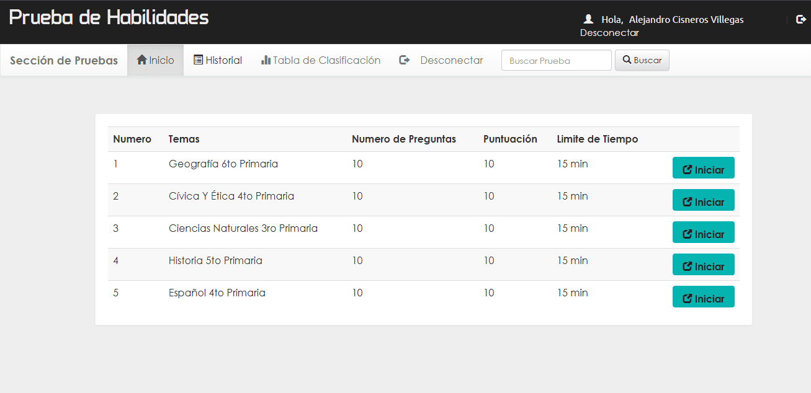
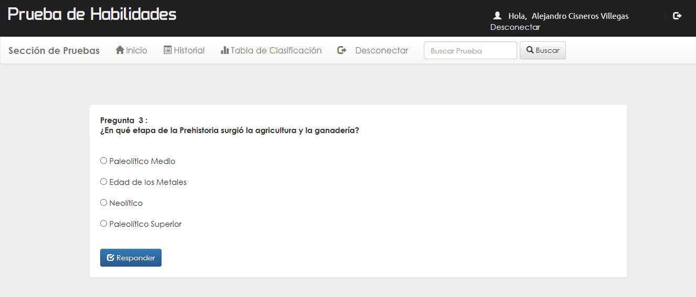
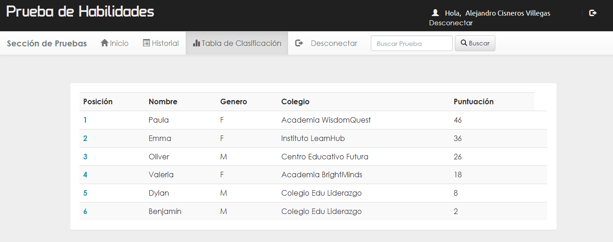
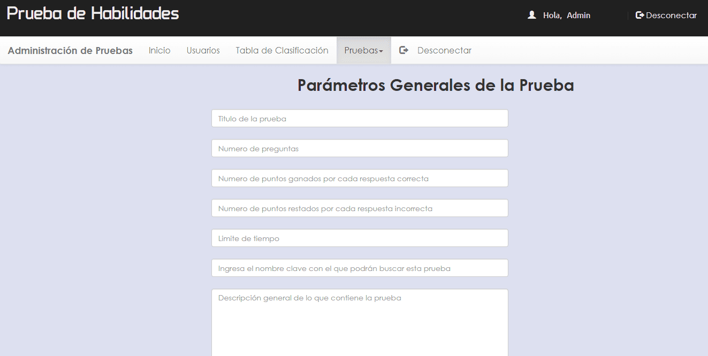

# Prueba de Habilidades

Desarrollada con **HTML, CSS, JavaScript, PHP y MySQL**, esta plataforma representa un sitio web educativo en línea diseñado para enriquecer los conocimientos de los usuarios en diversas áreas.

Los usuarios pueden registrarse en el sitio proporcionando detalles básicos como nombre, género, nombre de la escuela, correo electrónico y número de teléfono. Una vez registrados, tienen acceso a una amplia gama de pruebas de conocimiento que abarcan diversos temas.

<p align="center">
  
</p>

Cada prueba es personalizable por el administrador y puede constar de cualquier número de preguntas, con un valor de puntos determinado por respuesta. Además, el tiempo límite para completar cada prueba también es ajustable.

<p align="center">
  
</p>

Los resultados de las pruebas se almacenan en la base de datos del sistema, lo que permite a los usuarios rastrear su progreso a lo largo del tiempo.

<p align="center">
  
</p>

El sitio web también incluye una sección de clasificaciones donde los usuarios pueden comparar sus resultados con los de otros participantes, fomentando así una competencia saludable y brindando motivación para mejorar continuamente.

<p align="center">
  
</p>

Además, el sitio cuenta con un panel de administrador que ofrece un control completo sobre la plataforma. El administrador tiene la capacidad de gestionar usuarios, administrar las pruebas existentes y crear nuevas pruebas desde cero utilizando un formulario intuitivo.

<p align="center">
  
</p>

**Consulta la versión preliminar del proyecto aquí:** [https://prueba-de-habilidades.com](https://alejandrovillegas.net/projects/project-01/index.php)

# 📌 Información del Proyecto

Este proyecto ha sido desarrollado como parte del portafolio de soluciones tecnológicas, con el objetivo de ofrecer una herramienta eficiente y funcional para usuarios autodidactas interesados en la gestión y desarrollo de proyectos web.

- **Área**: Desarrollo de Proyectos Web

- **Usuario Final**: Autodidactas y Desarrolladores

- **Fecha de Desarrollo**: 10 de enero de 2024

- **Portafolio de Proyectos**: [www.alejandrovillegas.net](https://www.alejandrovillegas.net/)

# Guía de Instalación y Configuración del Proyecto

## 🖥️ Requisitos del Sistema

Para ejecutar este proyecto de manera local, es necesario contar con un entorno de desarrollo que incluya Apache, MySQL y PHP. Se recomienda el uso de **XAMPP**, ya que fue el entorno con el que se desarrolló el proyecto. Sin embargo, también es compatible con:

- **XAMPP** (Windows, macOS, Linux)

- **WAMP** (Windows)

- **MAMP** (macOS, Windows)

- **LAMP** (Linux)

## 🔧 Instalación y Configuración del Proyecto

Siga los pasos según el entorno de desarrollo que esté utilizando:

### Para XAMPP (Recomendado)

1. Descargue y descomprima el archivo del proyecto en su sistema local.

2. Copie la carpeta del proyecto y colóquela en el directorio **_htdocs_** dentro de la carpeta de instalación de XAMPP (Ejemplo: **C:\xampp\htdocs\mi_proyecto**).

### Para WAMP

1. Descargue y descomprima el archivo del proyecto.

2. Copie la carpeta del proyecto y colóquela en el directorio **_www_** dentro de la carpeta de instalación de WAMP (Ejemplo: **C:\wamp64\www\mi_proyecto**).

### Para MAMP

1. Descargue y descomprima el archivo del proyecto.

2. Copie la carpeta del proyecto y colóquela en el directorio **_htdocs_** dentro de la carpeta de instalación de MAMP (Ejemplo: **/Applications/MAMP/htdocs/mi_proyecto**).

### Para LAMP

1. Descargue y descomprima el archivo del proyecto.

2. Mueva la carpeta del proyecto a **_/var/www/html/_** utilizando el siguiente comando en la terminal:

```
sudo mv mi_proyecto /var/www/html/
```

## 🗄️ Configuración de la Base de Datos

### Para XAMPP, WAMP y MAMP

1. Inicie su entorno de desarrollo y asegúrese de que **Apache** y **MySQL** estén en ejecución.

2. Abra su navegador y acceda a **_phpMyAdmin_** ingresando:

- **XAMPP**: http://localhost/phpmyadmin

- **WAMP**: http://localhost/phpmyadmin

- **MAMP**: http://localhost:8888/phpmyadmin

3. Diríjase a la pestaña **SQL** e ingrese el siguiente código para crear la base de datos:

```
CREATE DATABASE General;
```

4. Vaya a la pestaña Importar y seleccione el archivo **_DataBase.sql_** del repositorio para importar la estructura y los datos.

### Para LAMP

1. Abra la terminal y acceda a MySQL con:

```
mysql -u root -p
```

2. Cree la base de datos ejecutando:

```
CREATE DATABASE General;
```

3. Salga de MySQL y luego importe la base de datos con:

```
mysql -u root -p General < /ruta/del/archivo/DataBase.sql
```

Reemplace **_/ruta/del/archivo/_** con la ubicación real del archivo en su sistema.

## 🚀 Ejecución del Proyecto

1. Inicie su entorno de desarrollo:

- **XAMPP**: Abra el "Panel de Control de XAMPP" y active **Apache** y **MySQL**.

- **WAMP**: Haga clic en el icono de WAMP y active los servicios.

- **MAMP**: Abra MAMP y haga clic en **Start Servers**.

- **LAMP**: Ejecute los siguientes comandos en la terminal:

```
sudo systemctl start apache2
sudo systemctl start mysql
```

2. Abra un navegador e ingrese la siguiente URL según el entorno:

- **XAMPP / WAMP**: **_http://localhost/_**

- **MAMP**: **_http://localhost:8888/_**

- **LAMP**: **_http://localhost/_**

El proyecto ahora está funcionando en su entorno local. 🎉

## 🔑 Credenciales de Acceso

### 🛠️ Detalles de Inicio de Sesión para Administrador

- Nombre de usuario: **_admin@gmail.com_**

- Contraseña: **_admin_**

### 👤 Detalles de Inicio de Sesión para Usuario Preregistrado

- Nombre de usuario: **_alex@gmail.com_**

- Contraseña: **_12345_**

Tambien puede **registrar un nuevo usuario** desde la interfaz de la aplicación.
